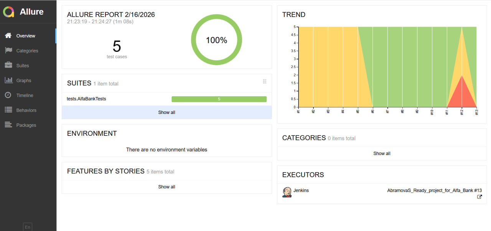
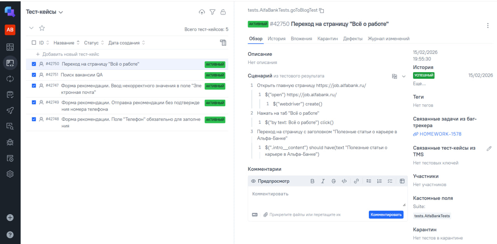

# Проект по автоматизации тестовых сценариев для сайта вакансий Альфа-Банка

___
📋 Содержание
---
- [Инструменты и технологии](#инструменты-и-технологии)
- [Описание проекта](#описание-проекта)
- [Запуск автотестов](#запуск-автотестов)
- [Сборка в Jenkins](#сборка-в-jenkins)
- [Пример Allure-отчета](#пример-allure-отчета)
- [Интеграция с Allure TestOps](#интеграция-с-Allure-TestOps)
- [Интеграция с  Jira](#интеграция-с-Jira)
- [Уведомление в Telegram](#уведомление-в-telegram)
- [Пример видео из Selenoid](#пример-видео-из-selenoid)
---
## <a id="инструменты-и-технологии">Инструменты и технологии</a>

---

   <abbr title="Java"></abbr>
   <abbr title="Gradle"></abbr>
   <abbr title="Selenoid"></abbr>
   <abbr title="JUnit 5"></abbr>
   <abbr title="Jenkins"></abbr>
   <abbr title="Selenoid"></abbr>
   <abbr title="Allure"></abbr>
   <abbr title="Allure TestOps"></abbr>
   <abbr title="Jira"></abbr>
   <abbr title="Telegram"></abbr>

## <a id="описание-проекта">Описание проекта</a>
UI-автотесты написаны на языке `Java` c использованием `JDK 17`, `Gradle`, а также библиотек `Selenide` и `JUnit 5`.
Удаленный запуск тестов происходит через джобу в [Jenkins](https://jenkins.autotests.cloud/view/java_students/job/AbramovaS_Ready_project_for_Alfa_Bank/), 
которая также отвечает за генерацию [Allure-отчетов](https://jenkins.autotests.cloud/view/java_students/job/AbramovaS_Ready_project_for_Alfa_Bank/14/allure/) и отправку уведомлений о 
результатах в Telegram. Для комплексного анализа результатов настроена интеграция с 
системами [Allure TestOps](https://allure.autotests.cloud/jobrun/51167) и [Jira](https://jira.autotests.cloud/browse/HOMEWORK-1578).
## <a id="запуск-автотестов">Запуск автотестов</a>
## <a id="сборка-в-jenkins">Сборка в Jenkins</a>

## <a id="пример-allure-отчета">Пример Allure-отчета</a>
### Обзорная информация

### Тест-кейсы

## <a id="интеграция-с-Allure-TestOps">Интеграция с Allure TestOps</a>
### Дашборд

### Тест-кейсы

## <a id="интеграция-с-Jira">Интеграция с  Jira</a>

## <a id="уведомление-в-telegram">Уведомление в Telegram</a>

## <a id="пример-видео-из-selenoid">Пример видео из Selenoid</a>

