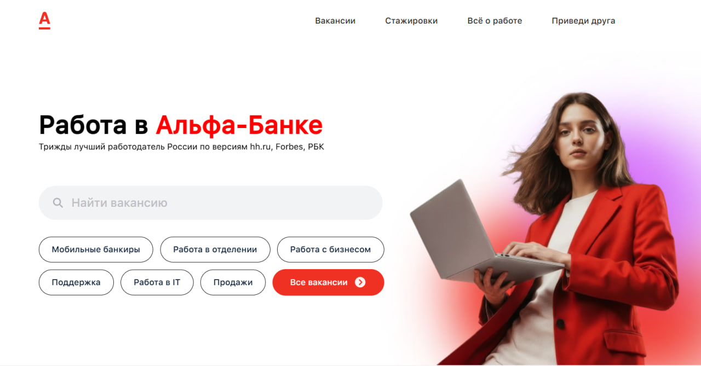
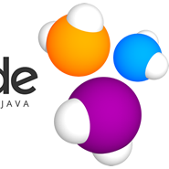
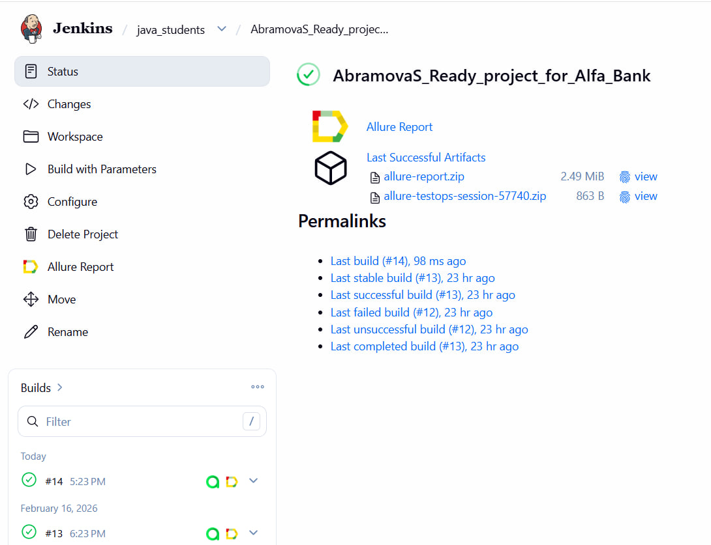
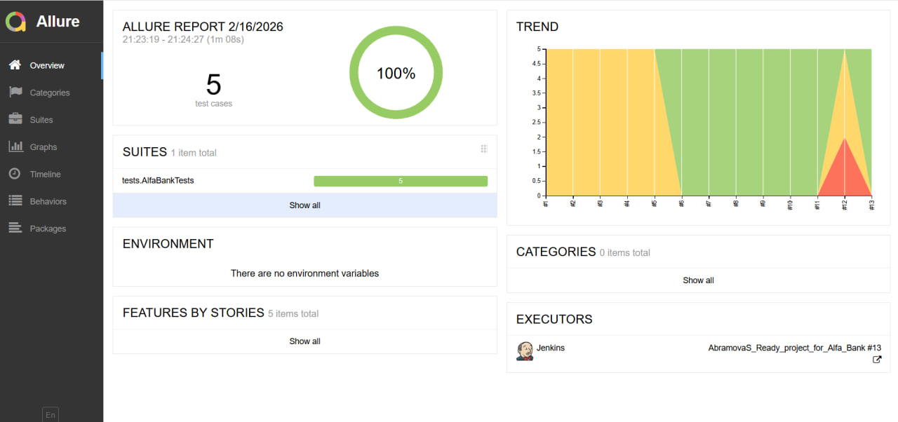
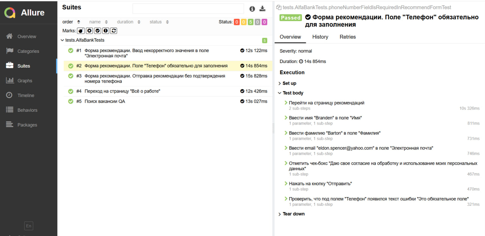
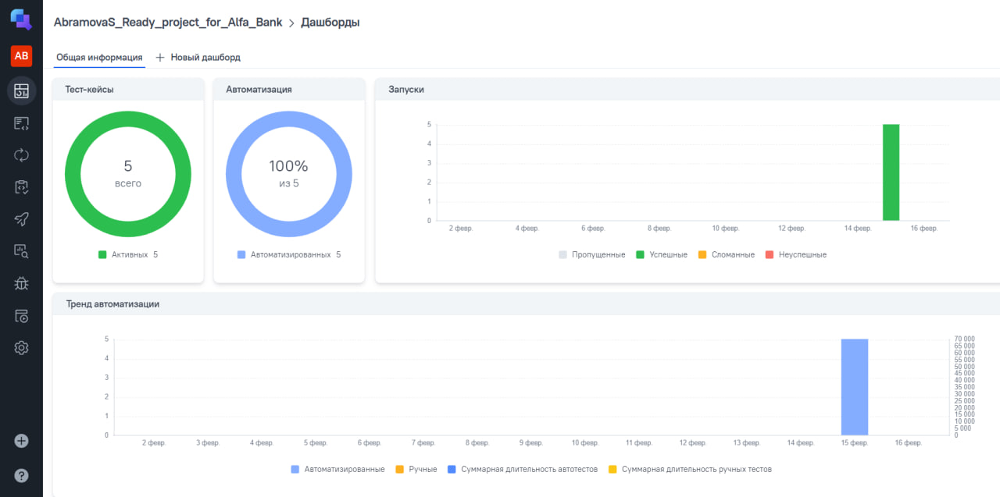
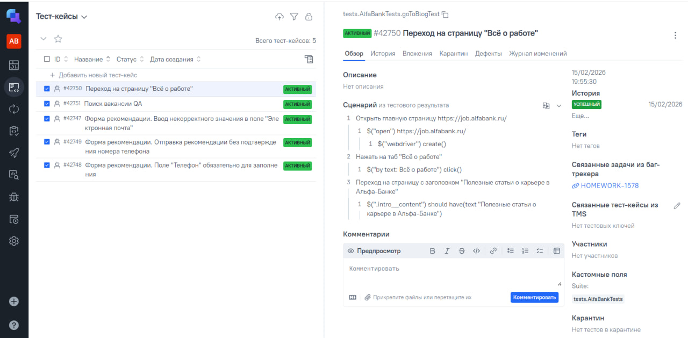
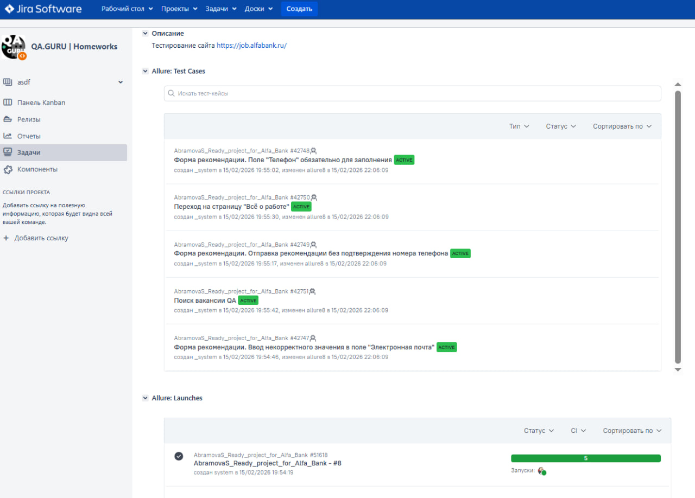
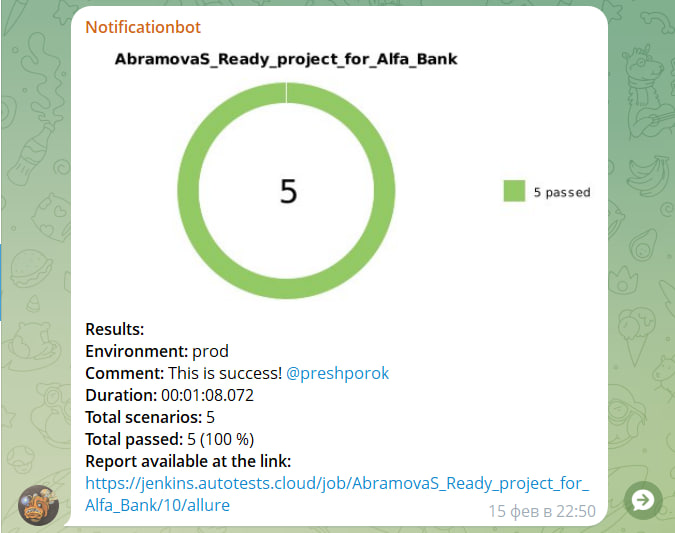
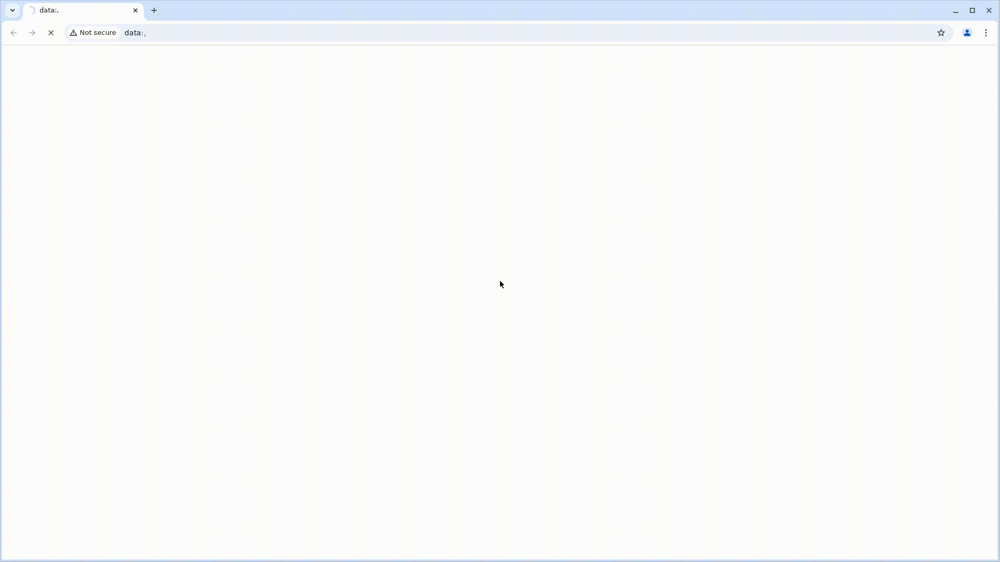

# Проект по автоматизации тестовых сценариев для [сайта](https://job.alfabank.ru/) вакансий Альфа-Банка


<abbr title="Java"></abbr> Содержание
---
- [Инструменты и технологии](#инструменты-и-технологии)
- [Описание проекта](#описание-проекта)
- [Запуск автотестов](#запуск-автотестов)
- [Сборка в Jenkins](#сборка-в-jenkins)
- [Пример Allure-отчета](#пример-allure-отчета)
- [Интеграция с Allure TestOps](#интеграция-с-Allure-TestOps)
- [Интеграция с  Jira](#интеграция-с-Jira)
- [Уведомление в Telegram](#уведомление-в-telegram)
- [Пример видео из Selenoid](#пример-видео-из-selenoid)
---
## <a id="инструменты-и-технологии">Инструменты и технологии</a>

<p align="center">
   <a href="https://www.java.com" target="_blank" rel="noopener"></a>
   <a href="https://gradle.org" target="_blank" rel="noopener"></a>
   <a href="https://selenide.org" target="_blank" rel="noopener"></a>
   <a href="https://junit.org/junit5/" target="_blank" rel="noopener"></a>
   <a href="https://www.jenkins.io" target="_blank" rel="noopener"></a>
   <a href="https://aerokube.com/selenoid/" target="_blank" rel="noopener"></a>
   <a href="https://allure.qatools.ru" target="_blank" rel="noopener"></a>
   <a href="https://allure.qatools.ru/testops" target="_blank" rel="noopener"></a>
   <a href="https://www.atlassian.com/software/jira" target="_blank" rel="noopener"></a>
   <a href="https://telegram.org" target="_blank" rel="noopener"></a>

## <a id="описание-проекта">Описание проекта</a>

UI-автотесты написаны на языке `Java` c использованием `JDK 17`, `Gradle`, а также библиотек `Selenide` и `JUnit 5`.
Удаленный запуск тестов происходит через джобу в [Jenkins](https://jenkins.autotests.cloud/view/java_students/job/AbramovaS_Ready_project_for_Alfa_Bank/), 
которая также отвечает за генерацию Allure-отчетов и отправку уведомлений о 
результатах в Telegram. Для комплексного анализа результатов настроена интеграция с 
системами [Allure TestOps](https://allure.autotests.cloud/jobrun/51167) и [Jira](https://jira.autotests.cloud/browse/HOMEWORK-1578).
## <a id="запуск-автотестов">Запуск автотестов</a>
**Локальный запуск через терминал**
```
gradle clean test
```
**Удалённый запуск в Jenkins**
```
clean test 
-DbaseUrl=${baseUrl}" 
-DremoteUrl=${remoteUrl}"
-Dbrowser=${browser}" 
-Dversion=${browserVersion}"
-DbrowserSize=${browserSize}" 
```
**Параметры сборки**
- `BASE_URL` - базовый URL-адрес веб-сайта или приложения
- `REMOTE_URL` - удаленный URL (=Selenoid Hub URL)
- `BROWSER` - браузер для выполнения автотестов
- `BROWSER_VERSION` - версия браузера
- `BROWSER_SIZE` - размер окна браузера (ширина × высота)
## <a id="сборка-в-jenkins">Сборка в Jenkins</a>
Jenkins автоматизирует запуск автотестов при изменении кода или по расписанию. 
Для выбора параметров (например, окружения, браузера, версии браузера и т.д.) и запуска сборки в Jenkins необходимо нажать <kbd>Build with Parameters</kbd>.
После прогона формируется отчет: результаты тестов, включая скриншоты, логи и видео, сохраняются в формате Allure и доступны по ссылке.


## <a id="пример-allure-отчета">Пример Allure-отчета</a>
Увидеть результаты автотестов можно в интерактивном Allure-отчёте — с детальными скриншотами, логами, видео и историей запусков. 
Ссылка на отчёт доступна после успешного запуска сборки в Jenkins.
### Обзорная информация

### Тест-кейсы

## <a id="интеграция-с-Allure-TestOps">Интеграция с Allure TestOps</a>
Интеграция с Jenkins позволяет автоматически передавать результаты тестов из 
сборки в TestOps, где можно отслеживать историю запусков, анализировать прогоны, управлять тест-кейсами, дефектами и требованиями в одном месте. Через общие дашборды
можно делиться отчётами с командой и заказчиками.<br>
Jenkins-сборки можно запускать напрямую из Allure TestOps, выбрав нужную джобу и указав параметры.

### Дашборд

### Тест-кейсы

## <a id="интеграция-с-Jira">Интеграция с  Jira</a>
В проекте настроена автоматическая отправка данных о сборке из Jenkins в систему управления задачами и проектами - Jira. В результате в задачах Jira появляются:
- Ссылка на сборку в Jenkins с деталями (номер, статус, логи)
- Список изменений (коммиты, авторы)
- Статус тестов (прошли/упали — на основе Allure-отчёта)
- Привязка к задачам — каждая сборка автоматически связывается с соответствующими задачами (Epics, Stories, Bugs)


## <a id="уведомление-в-telegram">Уведомление в Telegram</a>
Результат прогона отправляется в чат мессенджера Telegram


## <a id="пример-видео-из-selenoid">Пример видео из Selenoid</a>



